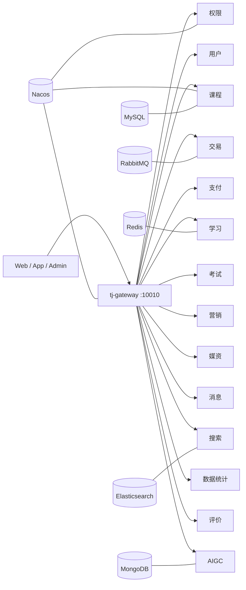

# 智能在线教育系统

智能在线教育系统是一个面向在线教育场景的 Java 微服务后端。项目以 Spring Boot 3、Spring Cloud、Spring Cloud Alibaba 为基础，覆盖用户、权限、课程、交易、支付、学习、考试、营销、媒资、消息、搜索、数据统计与 AIGC 等业务域。

> 当前仓库仅包含后端源码。完整运行还依赖 Nacos 配置、数据库结构及若干中间件；这些基础设施数据没有全部随源码提供，请先阅读“运行前准备”。

## 技术栈

| 分类 | 技术 |
| --- | --- |
| 运行环境 | Java 17、Maven |
| 基础框架 | Spring Boot 3.3.5、Spring Cloud 2023.0.3 |
| 微服务 | Spring Cloud Alibaba 2023.0.3.2、Nacos、OpenFeign、Gateway、Sentinel、Seata |
| 数据访问 | MyBatis-Plus 3.5.9、MySQL 8、Redis、Redisson |
| 消息与任务 | RabbitMQ、XXL-JOB |
| 搜索与文档 | Elasticsearch 7.12.1、Knife4j / OpenAPI 3 |
| AI 能力 | Spring AI 1.0.0、Spring AI Alibaba、DashScope、MongoDB |
| 云服务 | 阿里云 OSS / SMS、腾讯云 COS / VOD、支付宝、微信支付 |

## 系统结构



所有外部请求建议经由网关进入。服务通过 Nacos 完成注册发现和配置加载，共享能力放在 `tj-common`、`tj-api` 以及各业务 SDK 模块中。

## 模块与端口

| 模块 | 服务名 | 端口 | 网关前缀 | 职责 |
| --- | --- | ---: | --- | --- |
| `tj-gateway` | `gateway-service` | 10010 | - | 统一入口、路由与鉴权 |
| `tj-auth/tj-auth-service` | `auth-service` | 8081 | `/as` | 登录、令牌与权限 |
| `tj-user` | `user-service` | 8082 | `/us` | 用户与学员管理 |
| `tj-search` | `search-service` | 8083 | `/ss` | 课程搜索与兴趣推荐 |
| `tj-media` | `media-service` | 8084 | `/ms` | 文件、图片与视频媒资 |
| `tj-message/tj-message-service` | `message-service` | 8085 | `/sms` | 站内信、通知与短信 |
| `tj-course` | `course-service` | 8086 | `/cs` | 课程、分类与目录 |
| `tj-pay/tj-pay-service` | `pay-service` | 8087 | `/ps` | 支付、退款与回调 |
| `tj-trade` | `trade-service` | 8088 | `/ts` | 订单与交易 |
| `tj-exam` | `exam-service` | 8089 | `/es` | 题目、试卷与考试 |
| `tj-learning` | `learning-service` | 8090 | `/ls` | 学习记录、问答与笔记 |
| `tj-remark` | `remark-service` | 8091 | `/rs` | 评价与互动 |
| `tj-promotion` | `promotion-service` | 8092 | `/prs` | 优惠券与促销 |
| `tj-data` | `data-service` | 8093 | `/ds` | 数据聚合与统计 |
| `tj-aigc` | `aigc-service` | 8094 | `/ais` | 智能问答与 AI 助手 |

`tj-common` 提供通用工具与自动配置，`tj-api` 提供跨服务 DTO / Feign API；`tj-auth`、`tj-message`、`tj-pay` 内还包含 domain、API 或 SDK 子模块。

## 运行前准备

### 1. 本地工具

- JDK 17
- Maven 3.8 或更高版本
- Git
- Docker（可选，用于中间件或镜像构建）

确认环境：

```bash
java -version
mvn -version
```

### 2. 基础设施

按实际启用的服务准备以下组件：

- Nacos 2.x：所有服务都依赖注册发现和配置中心。
- MySQL 8.x：各业务服务使用独立逻辑库，例如 `tj_auth`、`tj_user`、`tj_course`、`tj_trade`。
- Redis 6.x 或更高版本。
- RabbitMQ 3.x：交易、消息、课程等异步流程会使用。
- Elasticsearch 7.12.x：搜索服务使用。
- MongoDB：AIGC 对话记忆使用。
- Seata、XXL-JOB：仅在启用相关分布式事务和定时任务时需要。

仓库目前没有提供完整的业务数据库初始化脚本和 Nacos 导出文件。`tj-aigc/src/main/resources/sql` 只包含 AIGC 局部数据结构，不能替代完整初始化数据。

### 3. Nacos 配置

每个服务会读取 `<spring.application.name>.yaml`，并按模块导入以下共享配置中的一部分：

```text
shared-spring.yaml
shared-redis.yaml
shared-mybatis.yaml
shared-logs.yaml
shared-feign.yaml
shared-mq.yaml
shared-seata.yaml
shared-xxljob.yaml
```

至少需要在 Nacos 中提供数据源、Redis 等当前服务实际引用的配置。连接信息不要写回仓库，请在 Nacos 或部署环境的密钥管理系统中维护。

### 4. 环境变量

参考 `.env.example`，将所需变量配置到 IDE、Shell、容器编排或 CI 密钥中。项目不会自动加载 `.env` 文件。

最小的本地 Nacos 配置示例（PowerShell）：

```powershell
$env:SPRING_PROFILES_ACTIVE = "local"
$env:NACOS_SERVER_ADDR = "127.0.0.1:8848"
$env:NACOS_USERNAME = "nacos"
$env:NACOS_PASSWORD = "你的密码"
$env:NACOS_NAMESPACE = ""
$env:NACOS_GROUP = "DEFAULT_GROUP"
```

支付、短信、对象存储与 AI 服务的变量是可选项，但启动或调用相应能力前必须配置。私钥若通过环境变量传入，请确认平台能正确保留 PEM 换行。

### 5. 生成认证密钥库

JKS、PEM 等密钥文件已被 Git 忽略。首次启动认证服务前，在本地生成密钥库：

```bash
keytool -genkeypair -alias tjxt -keyalg RSA -keysize 2048 -validity 3650 -keystore tj-auth/tj-auth-service/src/main/resources/tjxt.jks -storepass change-me -keypass change-me -dname "CN=tjxtai, OU=dev, O=lfeternity, L=local, ST=local, C=CN"
```

然后配置：

```powershell
$env:TJ_AUTH_KEYSTORE_PASSWORD = "change-me"
$env:TJ_AUTH_KEY_PASSWORD = "change-me"
```

生产环境应使用独立强密码，并通过挂载密钥文件或密钥管理服务提供 JKS。

## 构建

在仓库根目录执行：

```bash
mvn clean package -DskipTests
```

只构建某个服务及其依赖：

```bash
mvn -pl tj-gateway -am package -DskipTests
mvn -pl tj-auth/tj-auth-service -am package -DskipTests
```

构建产物位于各可运行模块的 `target/` 目录。

## 启动

建议顺序：

1. 启动 Nacos、MySQL、Redis 等基础设施。
2. 在 Nacos 中准备服务配置。
3. 启动 `auth-service` 和所需业务服务。
4. 最后启动 `gateway-service`。

开发环境可直接运行模块：

```bash
mvn -pl tj-auth/tj-auth-service -am spring-boot:run
mvn -pl tj-gateway -am spring-boot:run
```

也可以运行构建后的 JAR：

```bash
java -jar tj-gateway/target/tj-gateway.jar
```

单个服务启动成功后，Knife4j 文档通常位于：

```text
http://localhost:<服务端口>/doc.html
```

## Docker

根目录 `Dockerfile` 接收一个名为 `app.jar` 的构建产物：

```bash
cp tj-gateway/target/tj-gateway.jar app.jar
docker build -t tjxtai/gateway:local .
docker run --rm -p 10010:10010 --env-file .env tjxtai/gateway:local
```

`startup.sh` 是单服务镜像构建与重启脚本，默认项目根目录为 `/usr/local/src/tjxtai`，可通过 `BASE_PATH` 覆盖。生产部署建议使用 Docker Compose、Kubernetes 或 CI/CD 平台统一管理服务、网络和密钥。

## 测试

```bash
mvn test
```

部分测试属于第三方平台联调测试。未设置对应环境变量时，这些测试会跳过；配置真实凭据后才会访问支付宝或 DashScope 等外部服务。不要把令牌、私钥、JKS 或本地 `.env` 提交到 Git。

## 配置与安全约定

- 所有密码、令牌、云厂商密钥和支付私钥均通过环境变量或外部配置中心注入。
- `.env`、证书、IDE 文件、构建产物和临时文件默认不会进入版本库。
- 新增配置时，请同时更新 `.env.example`，示例值只使用占位符。
- 提交前检查 `git diff --cached`，避免日志、导出数据或测试账号进入提交。
- 已经暴露过的密钥不能通过删除文件恢复安全性，应立即在对应平台轮换。

## 维护

仓库：<https://github.com/lfeternity/tjxtai>

维护者：[@lfeternity](https://github.com/lfeternity)

## 许可证

本项目采用 [MIT License](LICENSE) 开源许可证。
